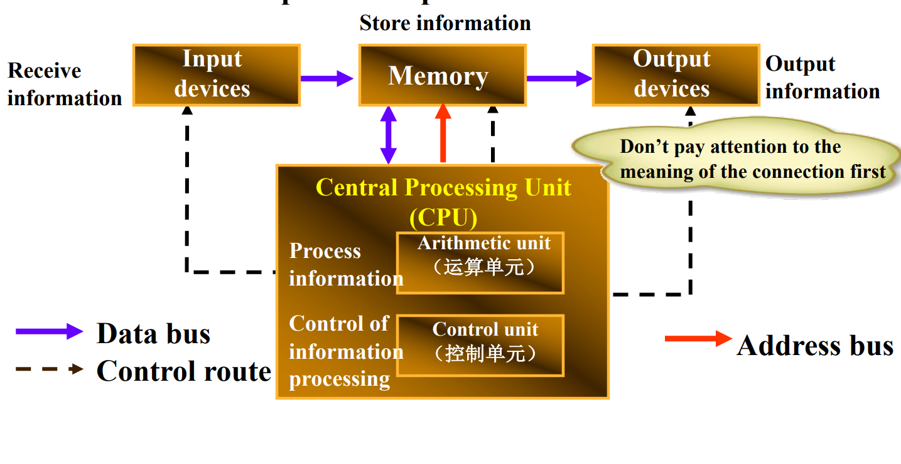

# 第一章 速通计算机常识

## 导言

*注意*: &nbsp;&nbsp;&nbsp;这一章文档针对电脑小白而写，如果你对这一部分比较熟悉，你可以选择跳转到第二章。

让我们开始吧！

---

## 目录

0. [第零部分：我们为什么要学编程](#第零部分：我们为什么要学编程)
1. [第一部分：硬件/软件基础](#第一部分：硬件/软件基础)
   - [0.什么是计算机](#什么是计算机)
   - [1. 解构黑盒子](#解构黑盒子)
   - [2. CPU、内存与储存](#CPU、内存与储存)
   - [3. 软件是什么？能吃吗](#软件是什么？能吃吗)
2. [第二部分：文件系统](#第二部分：文件系统)
   - [1. 文件是如何储存的？](#文件是如何储存的)
   - [2. 当我们运行程序时，发生了什么?](#当我们运行程序时，发生了什么)
   - [3. 程序、数据、显示](#程序、数据、显示)
3. [第三部分：编程语言概述](#第三部分：编程语言概述)
   - [1. 什么是编程语言？](#什么是编程语言)
   - [2. 编程语言的分类](#编程语言的分类)
   - [3. 高级语言向低级语言的转化](#高级语言向低级语言的转化)
4. [第四部分：在学习编程之前](#第四部分：在学习编程之前)
   - [1. 编程语言通识概论](#编程语言通识概论)
   - [2.程序语言的基础构成](#几种程序语言的构成)
   - [3. 几种程序结构](#几种程序结构)
   - [4. 常量、变量](#常量、变量)
   - [5. 运算符和基本运算](#运算符和基本运算)
   - [6. 函数、参数、不定参数](#函数、参数、不定参数)
   - [7. *C语言专属* 取指与指针](#C语言专属-取指与指针)
   - [8. 自定义数据结构/结构体](#自定义数据结构/结构体)
5. [第五部分：更高级的预习](#第五部分：更高级的预习)
   - [1. 面向对象编程](#面向对象编程)
   - [2. 类、方法、成员](#类、方法、成员)
   - [3. 成员属性、共享](#成员属性、共享)
   - [4. 类的继承](#类的继承)
   - [5. 虚类/工厂类](#虚类/工厂类)
6. [总结](#总结)

---

## 第零部分：我们为什么要学编程 

  有的时候，特别是在看本教材的你，也许会有这样一个问题：

                            **我们学编程干什么？**

很多人并不理解，然而我要说，在现代化的社会中，编程技术其实或不可缺。我们每天都在和这些东西打交道

比如

         or         

他们都离不开一个关键的东西，那就是编程。

事实上，在学习编程之后你也可以:

1.开发自己的程序(~~外挂~~)

2.解决一些工程(~~困难的高数/线代题~~)

3.~~收获强者的发际线~~

4.将创意变为现实

.....

更关键的:

## 你要考期末！

因此，让我们开始吧！

开始之前，请确保自己知道什么是二进制

<!-- 内容待填充 -->

## 第一部分：硬件/软件基础

### 0.什么是计算机？

  计算机是什么？计算机俗称“电脑”，人对计算机的超级期望，就是能够真的像人脑一样去工作。

而计算机其实为了执行人类的程序，从而把人类解放出来。

  简单来讲，计算机就是帮我们干活的机器，那么，现在就让我们来认识一下这台机器。

### 1. 解构黑盒子

### 从图灵机到现代计算机

### 图灵机的诞生

        1936年，英国数学家艾伦·图灵提出了一个革命性的概念——**图灵机**。这并非一台真实的机器，而是一个理论模型，用来定义"可计算性"的界限。

**图灵机的基本组成：**

- **无限长的纸带**：被划分为一个个小格子，每个格子可以存储一个符号

- **读写头**：可以在纸带上移动，读取或修改符号

- **状态寄存器**：记录图灵机当前的状态

- **控制规则表**：根据当前状态和读取的符号，决定下一步操作

图灵机的伟大之处在于证明了：**任何可计算的问题都可以用这样的简单机器来解决**。

### 冯·诺依曼架构

1945年，数学家冯·诺依曼在图灵机的基础上，提出了现代计算机的基本架构——**冯·诺依曼架构**，这一架构至今仍是绝大多数计算机的设计基础。

**五大核心部件：**

1. **运算器（ALU）** - 负责所有的算术和逻辑运算（读写头）

2. **控制器（CU）** - 指挥协调各部件工作，相当于"大脑"（规则控制表）

3. **存储器（内存）** - 临时存储正在运行的程序和数据（纸带）

4. **输入设备** - 键盘、鼠标等，用于向计算机输入信息（外部输入）

5. **输出设备** - 显示器、打印机等，用于输出结果（输出）

在上面的图片中，我们可以看到冯诺依曼架构的具体构造，那么，这个体系是如何运行的呢？让我们来模拟一下：

1. 首先，输入设备收到了用户输入的指令‘计算1+1=?’

2. 然后，将这条指令通过蓝色的数据运输线运输给内存，内存再将指令发给中央处理器
   
   - 为什么需要先给内存呢？这里我们先忽略这个问题，让我们后面再回头来看。

3. 接着，中央处理器按照指令，计算出结果，并把数据返回给内存，接着告诉输出设备去内存中取出计算结果

4. 于是，你就得到了"1+1=2"

### 2. CPU、内存与储存

在我们真实的电脑上，除了内存(上文的Memory)以外，实际上还有好几种储存的方式。为什么不能直接用一种方式储存所有数据呢？请看下面这张图

看不懂？没关系！

其实很简单，那就是性 价 比！

不同的内存形式速度和价格是不一样的，因为CPU处理数据极快，因此我们需要与之匹配的快速内存，而CPU能直接操控的，就是寄存器，然而寄存器其实相当小，小到什么程度？

大概只有几十kb（kb,千字节，[计算机储存单位](#附录1)中的一种）根本存不下什么东西，因此，为了配合寄存器，人们设计出了一级缓存(L1 Cache)，一级缓存速度快，而且储存量变大了，可以储存更多数据，但是还是很贵，而且大小也没大到哪儿去，通常大小在几百 KB 到几 MB 不等

于是L2、L3缓存出现了

最后，内存出现了，更正确的说，应该是**运行内存**，它和硬盘不同。

运行内存又叫RAM(随机存储器)，它有如下特点：

- 临时存储运行中的程序和数据

- 读写速度极快（比硬盘快100倍以上）

- **断电后数据丢失**

- 容量通常：8GB、16GB、32GB

对，没错，第三条是致命的，一旦计算机关机，内存中的数据就会丢失，而为了持久化储存我们的数据，因此我们又向计算机中加入了硬盘这种储存设备，它们通过

### 3. 软件是什么？能吃吗

<!-- 内容待填充 -->

## 第二部分：文件系统

### 1. 文件是如何储存的？

<!-- 内容待填充 -->

### 2. 当我们运行程序时，发生了什么?

<!-- 内容待填充 -->

### 3. 程序、数据、显示

<!-- 内容待填充 -->

## 第三部分：编程语言概述

### 1. 什么是编程语言？

<!-- 内容待填充 -->

### 2. 编程语言的分类

<!-- 内容待填充 -->

### 3. 高级语言向低级语言的转化

<!-- 内容待填充 -->

## 第四部分：在学习编程之前

### 1. 编程语言通识概论

<!-- 内容待填充 -->

### 2. 几种程序结构

<!-- 内容待填充 -->

### 3. 常量、变量

<!-- 内容待填充 -->

### 4. 运算符和基本运算

<!-- 内容待填充 -->

### 5. 函数、参数、不定参数

<!-- 内容待填充 -->

### 6. *C语言专属* 取指与指针

<!-- 内容待填充 -->

### 7. 自定义数据结构/结构体

<!-- 内容待填充 -->

## 第五部分：更高级的预习

### 1. 面向对象编程

<!-- 内容待填充 -->

### 2. 类、方法、成员

<!-- 内容待填充 -->

### 3. 成员属性、共享

<!-- 内容待填充 -->

### 4. 类的继承

<!-- 内容待填充 -->

### 5. 虚类/工厂类

<!-- 内容待填充 -->

## 总结

<!-- 内容待填充 -->

   

---

### 附录1：

### 计算机储存单位

# 计算机储存单位及其转换

## 基本单位：比特（bit）和字节（Byte）

### 最小单位：比特（bit）

- **定义**：二进制数字（binary digit）的最小单位

- **取值**：只能是0或1

- **表示**：一个开关状态、一个电路的通断

- **重要性**：所有数字信息的基础构建块

### 基本单位：字节（Byte）

- **定义**：8个比特组成1个字节

- **重要性**：计算机处理信息的基本单位

- **示例**：

  - 1个英文字符 = 1字节

  - 1个中文字符 ≈ 2-3字节（取决于编码）

**换算关系**：**1 Byte = 8 bits**

## 储存单位体系

### 二进制单位体系（计算机内部使用）

| 单位   | 缩写   | 换算关系              | 实际大小                    |
| ---- | ---- | ----------------- | ----------------------- |
| 字节   | Byte | 1 Byte = 8 bits   | 8位                      |
| 千字节  | KB   | 1 KB = 1024 Bytes | 1,024字节                 |
| 兆字节  | MB   | 1 MB = 1024 KB    | 1,048,576字节             |
| 千兆字节 | GB   | 1 GB = 1024 MB    | 1,073,741,824字节         |
| 太字节  | TB   | 1 TB = 1024 GB    | 1,099,511,627,776字节     |
| 拍字节  | PB   | 1 PB = 1024 TB    | 1,125,899,906,842,624字节 |

### 十进制单位体系（硬盘厂商使用）

| 单位   | 缩写  | 换算关系              | 实际大小                |
| ---- | --- | ----------------- | ------------------- |
| 千字节  | KB  | 1 KB = 1000 Bytes | 1,000字节             |
| 兆字节  | MB  | 1 MB = 1000 KB    | 1,000,000字节         |
| 千兆字节 | GB  | 1 GB = 1000 MB    | 1,000,000,000字节     |
| 太字节  | TB  | 1 TB = 1000 GB    | 1,000,000,000,000字节 |

## 为什么有两种标准？

### 历史原因

- **计算机科学**：基于二进制（2的10次方=1024）

- **商业营销**：硬盘厂商使用十进制，让容量"看起来更大"

## 常见文件大小参考

### 文档类

- 纯文本文件：几KB到几十KB

- Word文档：几十KB到几MB

- PDF文件：几百KB到几十MB

- 电子书：1-10MB

### 多媒体类

- MP3歌曲：3-10MB

- 高清照片：2-10MB

- 1080p电影：1-3GB

- 4K电影：10-20GB

### 程序类

- 手机App：10-500MB

- PC游戏：10-100GB

- 操作系统：4-20GB

## 特殊单位概念

### 字（Word）

- **定义**：CPU一次处理的数据长度

- **大小**：取决于处理器架构（32位=4字节，64位=8字节）

### nibble（半字节）

- **定义**：4个比特，半个字节

- **用途**：在某些低级编程中使用

---